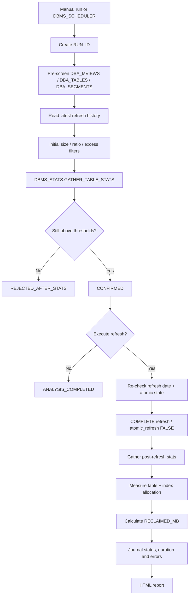

# Oracle Materialized View Space Reclaimer

[Version française](README_FR.md)

A DBA automation project for detecting materialized views whose allocated storage has become disproportionate to their current data volume, validating the finding with fresh optimizer statistics, and optionally reclaiming space with a controlled `COMPLETE` refresh using `atomic_refresh => FALSE`.

> Public portfolio version. Internal hostnames, schema names, e-mail addresses and infrastructure details have been anonymized. Review every threshold, privilege and maintenance-window assumption before using this code.

## Problem

The project started with a materialized view whose segment was hundreds of MB larger than the data it actually contained. A normal space-reclamation attempt using segment shrink produced almost no benefit in the pilot. Investigation showed that the problem was not simply row count: the segment retained a large allocation even though the logical row volume had become small.

The diagnosis compared:

- logical row volume: `NUM_ROWS * AVG_ROW_LEN`;
- physical table-segment allocation: `DBA_SEGMENTS.BYTES`;
- index allocation: sum of index segment bytes;
- last MV refresh date and refresh history;
- the `ATOMIC_REFRESH` value used by the latest successful refresh;
- measured table/index allocation after maintenance.

## Why `SHRINK SPACE` was not the final solution in this case

Oracle supports segment shrink for materialized views, and it remains a valid option. In the pilot, however, shrink did not materially reduce the segment. The diagnostic showed that only a very small amount of space could be released at the end of the segment, while most of the reusable free space remained inside the allocated segment below the high-water mark.

The project therefore tested an Oracle-supported `COMPLETE` non-atomic refresh:

```sql
DBMS_MVIEW.REFRESH(
    list           => '<OWNER>.<MVIEW_NAME>',
    method         => 'C',
    atomic_refresh => FALSE,
    out_of_place   => FALSE
);
```

Oracle documents that a non-atomic refresh can optimize a refresh by using truncate DDL. For a COMPLETE refresh, this can rebuild the materialized-view contents and reduce an excessively allocated segment.

## Important safety property

This is not a transparent online compaction. During a COMPLETE non-atomic refresh, the MV can be temporarily empty. If reload fails after the old contents are removed, the MV can remain empty until a successful refresh is performed.

For that reason, the framework adds controls around the refresh instead of running `atomic_refresh => FALSE` blindly.

## Architecture



More detail: [architecture.md](architecture.md).

## Candidate selection model

A candidate must pass all three thresholds after fresh statistics are collected:

```text
TABLE_MB  >= P_MIN_ALLOCATED_MB
RATIO_X   >= P_MIN_RATIO_X
EXCESS_MB >= P_MIN_EXCESS_MB
```

with:

```text
ESTIMATED_DATA_BYTES = NUM_ROWS * AVG_ROW_LEN
RATIO_X              = TABLE_BYTES / ESTIMATED_DATA_BYTES
EXCESS_BYTES         = TABLE_BYTES - ESTIMATED_DATA_BYTES
```

The logical estimate is intentionally lightweight. It is a screening signal, not an exact block-by-block space-usage calculation. The real success criterion is `RECLAIMED_MB` measured after the refresh.

## Two-stage decision

The first query is only a pre-screen and can use existing statistics. Each preselected MV then receives fresh table statistics. Only the refreshed `NUM_ROWS` and `AVG_ROW_LEN` values are used to confirm or reject the candidate. This avoids triggering maintenance directly from stale optimizer statistics.

## Refresh-history guard

The code uses `DBA_MVREF_STATS` and `DBA_MVREF_RUN_STATS` to find the latest refresh attempt and inspect `ATOMIC_REFRESH`. Before changing an MV, the procedure checks again that the last refresh date has not changed and that the refresh history is still in the expected state.

The automatic scope is intentionally limited to valid, non-partitioned, `REFRESH ON DEMAND`, `COMPLETE` MVs. `ON COMMIT` / `ON STATEMENT` objects should be assessed separately because their refresh lifecycle is tied more directly to application transactions.

## Main procedure

```sql
DECLARE
    L_RUN_ID NUMBER;
BEGIN
    ADMINISTRATION.ADM_COMPACT_MV_CANDIDATES
    (
        P_OWNERS            => 'APP_SCHEMA_1,APP_SCHEMA_2',
        P_MIN_ALLOCATED_MB  => 100,
        P_MIN_RATIO_X       => 5,
        P_MIN_EXCESS_MB     => 100,
        P_EXECUTE_REFRESH   => 'N',
        P_STOP_ON_ERROR     => 'Y',
        P_RUN_ID            => L_RUN_ID
    );
END;
/
```

Parameter meaning:

| Parameter | Purpose |
|---|---|
| `P_OWNERS` | Approved schemas to scan |
| `P_MIN_ALLOCATED_MB` | Ignore small MV table segments |
| `P_MIN_RATIO_X` | Require a strong allocation/data mismatch |
| `P_MIN_EXCESS_MB` | Require a meaningful estimated reclaim opportunity |
| `P_EXECUTE_REFRESH` | `N` = analysis only, `Y` = perform non-atomic COMPLETE refresh |
| `P_STOP_ON_ERROR` | Stop at first refresh error or continue |
| `P_RUN_ID` | Campaign identifier used for audit and reporting |

## Validation results

Representative anonymized test results:

| Case | Total before | Total after | Reclaimed | Reduction | Refresh time |
|---|---:|---:|---:|---:|---:|
| Small MV | 112 MB | 0.69 MB | 111.31 MB | ~99.4% | 6 s |
| Medium MV | 181 MB | 37 MB | 144 MB | ~79.6% | 4 s |
| Medium MV | 163 MB | 4 MB | 159 MB | ~97.5% | 2 s |
| Large MV | 14,129.63 MB | 430 MB | 13,699.63 MB | ~97.0% | 20 s |
| Scheduled validation | 1,843 MB | 422 MB | 1,421 MB | ~77.1% | 16 s |

See [examples/sample-results.md](examples/sample-results.md).

## Repository files

```text
space-reclaimer/
├── README.md
├── README_FR.md
├── architecture.md
├── troubleshooting.md
├── examples/
│   └── sample-results.md
└── sql/
    ├── 01_create_repository_objects.sql
    ├── 02_required_privileges.sql
    ├── 03_adm_compact_mv_candidates.sql
    ├── 04_adm_send_mv_compact_report.sql
    ├── 05_scheduler_job.sql
    └── 06_reporting_queries.sql
```

## Deployment order

1. Review [sql/02_required_privileges.sql](sql/02_required_privileges.sql) and grant only what is appropriate.
2. Create the audit objects with [sql/01_create_repository_objects.sql](sql/01_create_repository_objects.sql).
3. Compile [sql/03_adm_compact_mv_candidates.sql](sql/03_adm_compact_mv_candidates.sql).
4. Optionally deploy the HTML mail report from [sql/04_adm_send_mv_compact_report.sql](sql/04_adm_send_mv_compact_report.sql).
5. Run first with `P_EXECUTE_REFRESH => 'N'`.
6. Validate the candidate list and statistics.
7. Test one small MV in a maintenance window with `P_EXECUTE_REFRESH => 'Y'`.
8. Only then enable the Scheduler example in [sql/05_scheduler_job.sql](sql/05_scheduler_job.sql).

## Troubleshooting learned during implementation

Two Oracle-specific issues were especially useful during development:

- a definer-rights stored procedure (`AUTHID DEFINER`) cannot rely on privileges inherited only through a role for static SQL; direct grants were required for the DBA dictionary views used by the procedure;
- on the tested environment, qualifying `SYS.DBMS_MVIEW` failed because `DBMS_MVIEW` resolved through a synonym to the physical implementation package. The actual object/synonym mapping must be checked before granting EXECUTE.

Details: [troubleshooting.md](troubleshooting.md).

## Oracle documentation

- DBMS_MVIEW: https://docs.oracle.com/en/database/oracle/oracle-database/19/arpls/DBMS_MVIEW.html
- Refreshing materialized views: https://docs.oracle.com/en/database/oracle/oracle-database/19/dwhsg/refreshing-materialized-views.html
- ALTER MATERIALIZED VIEW / shrink: https://docs.oracle.com/en/database/oracle/oracle-database/19/sqlrf/ALTER-MATERIALIZED-VIEW.html
- DBA_MVREF_STATS: https://docs.oracle.com/en/database/oracle/oracle-database/19/refrn/DBA_MVREF_STATS.html

## Disclaimer

This repository is a technical portfolio and operational starting point, not a universal production recipe. A non-atomic COMPLETE refresh can affect availability and should be validated against workload, dependencies, recovery procedures and maintenance windows before production use.
