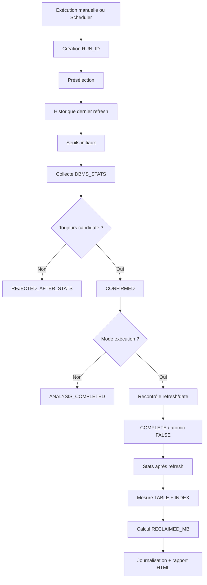

# Récupération d'espace des vues matérialisées Oracle

[English version](README.md)

Ce mini-projet DBA automatise la détection des vues matérialisées dont le segment est devenu très supérieur au volume logique des données, confirme le diagnostic avec des statistiques fraîches puis peut exécuter un refresh `COMPLETE` avec `atomic_refresh => FALSE` afin de récupérer l'espace suralloué.

> Version publique/portfolio : noms de serveurs, schémas applicatifs, e-mails et détails d'infrastructure ont été anonymisés.

## Problème rencontré

Le point de départ était une vue matérialisée occupant plusieurs centaines de Mo alors que son volume logique était très faible. Une tentative de `SHRINK SPACE` a été réalisée, mais elle n'a pratiquement pas réduit le segment dans le cas pilote. Le diagnostic a montré que très peu d'espace pouvait être rendu en fin de segment alors qu'une grande quantité d'espace libre restait à l'intérieur de l'allocation existante.

L'analyse a donc comparé :

- le volume logique estimé : `NUM_ROWS * AVG_ROW_LEN` ;
- l'espace physique alloué au segment TABLE : `DBA_SEGMENTS.BYTES` ;
- la taille des index associés ;
- la date et l'historique des refresh ;
- le mode `ATOMIC_REFRESH` du dernier refresh valide ;
- la taille réellement mesurée après maintenance.

## Pourquoi `atomic_refresh => FALSE`

Oracle documente qu'un refresh non atomique peut optimiser le refresh en utilisant notamment un `TRUNCATE`. Pour un refresh COMPLETE, cela permet de reconstruire le contenu de la MV et, dans ce scénario, de ramener le segment vers une taille cohérente avec les données réellement présentes.

```sql
DBMS_MVIEW.REFRESH(
    list           => '<OWNER>.<MVIEW_NAME>',
    method         => 'C',
    atomic_refresh => FALSE,
    out_of_place   => FALSE
);
```

Ce choix n'est pas sans risque : pendant le refresh, la MV peut être temporairement vide. En cas d'échec après le vidage, elle peut rester vide jusqu'à un refresh réussi. C'est pourquoi la solution ajoute une phase d'analyse, des seuils, des contrôles de concurrence et une journalisation complète.

## Critères de sélection

Une candidate doit respecter, après collecte de statistiques fraîches :

```text
TABLE_MB  >= P_MIN_ALLOCATED_MB
RATIO_X   >= P_MIN_RATIO_X
EXCESS_MB >= P_MIN_EXCESS_MB
```

avec :

```text
ESTIMATED_DATA_BYTES = NUM_ROWS * AVG_ROW_LEN
RATIO_X              = TABLE_BYTES / ESTIMATED_DATA_BYTES
EXCESS_BYTES         = TABLE_BYTES - ESTIMATED_DATA_BYTES
```

## Déroulement



## Résultats anonymisés

| Cas | Avant | Après | Récupéré | Réduction | Durée |
|---|---:|---:|---:|---:|---:|
| Petite MV | 112 Mo | 0,69 Mo | 111,31 Mo | ~99,4 % | 6 s |
| MV moyenne | 181 Mo | 37 Mo | 144 Mo | ~79,6 % | 4 s |
| MV moyenne | 163 Mo | 4 Mo | 159 Mo | ~97,5 % | 2 s |
| Grande MV | 14 129,63 Mo | 430 Mo | 13 699,63 Mo | ~97,0 % | 20 s |
| Validation planifiée | 1 843 Mo | 422 Mo | 1 421 Mo | ~77,1 % | 16 s |

## Points techniques validés

- présélection dynamique sans nom de MV en dur ;
- statistiques fraîches avant décision ;
- comparaison allocation physique / volume logique ;
- contrôle de l'historique `ATOMIC_REFRESH` ;
- contrôle qu'aucun refresh concurrent n'a eu lieu entre analyse et exécution ;
- refresh COMPLETE non atomique ;
- mesure de la table et des index avant/après ;
- calcul de l'espace réellement récupéré ;
- journalisation par `RUN_ID` ;
- gestion des erreurs ;
- génération d'un rapport HTML ;
- automatisation via `DBMS_SCHEDULER`.

## Scripts

Les scripts sont disponibles dans le dossier [sql](sql/). Commencer obligatoirement par un lancement avec `P_EXECUTE_REFRESH => 'N'`, puis valider une seule petite MV avant toute automatisation.

## Limite volontaire

Le périmètre automatique actuel cible les MV valides, non partitionnées, en `REFRESH ON DEMAND` et méthode `COMPLETE`. Les MV `ON COMMIT` / `ON STATEMENT` peuvent également être surallouées, mais elles sont volontairement exclues de l'automatisation car leur cycle de refresh est plus directement lié aux transactions applicatives.

## Documentation Oracle

- https://docs.oracle.com/en/database/oracle/oracle-database/19/arpls/DBMS_MVIEW.html
- https://docs.oracle.com/en/database/oracle/oracle-database/19/dwhsg/refreshing-materialized-views.html
- https://docs.oracle.com/en/database/oracle/oracle-database/19/sqlrf/ALTER-MATERIALIZED-VIEW.html

## Avertissement

Un refresh COMPLETE non atomique peut avoir un impact sur la disponibilité. Les scripts doivent être adaptés et testés dans un environnement de développement ou de recette avant toute utilisation en production.
