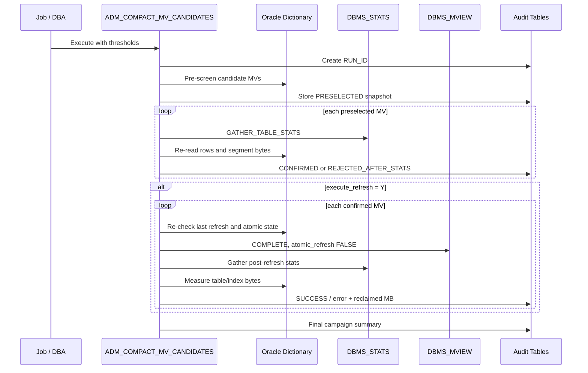

# Architecture and design notes

## Objective

The framework separates **detection**, **validation**, **execution**, and **measurement**. The goal is to avoid using a single heuristic as justification for a destructive maintenance operation.

## Data sources

| Source | Purpose |
|---|---|
| `DBA_MVIEWS` | MV identity, refresh method/mode, compile state and last refresh date |
| `DBA_TABLES` | `NUM_ROWS`, `AVG_ROW_LEN`, `LAST_ANALYZED` |
| `DBA_SEGMENTS` | Physically allocated table/index bytes, blocks and extents |
| `DBA_INDEXES` | Indexes attached to the MV table |
| `DBA_MVREF_STATS` | Per-MV refresh history and `REFRESH_ID` |
| `DBA_MVREF_RUN_STATS` | Run-level refresh parameters including `ATOMIC_REFRESH` and failures |

## Decision flow



## Why two-stage statistics

The first stage is intentionally cheap. Existing statistics are used only to produce a short candidate list. Fresh optimizer statistics are then collected only for preselected objects, which reduces cost and prevents stale statistics from directly triggering the refresh.

## Physical versus logical size

The framework uses:

```text
logical estimate  = NUM_ROWS * AVG_ROW_LEN
physical table MB = DBA_SEGMENTS.BYTES / 1024 / 1024
```

`NUM_ROWS * AVG_ROW_LEN` is not an exact measurement of used blocks. It is deliberately a screening estimate. Physical allocation can include block overhead, free space inside blocks, reusable blocks below the high-water mark, extent rounding and other storage effects.

## Concurrency guard

A candidate can become unsafe between analysis and execution. Immediately before the refresh the procedure re-reads the MV's `LAST_REFRESH_DATE` and latest refresh history. If the state has changed, the MV is skipped rather than refreshed from stale assumptions.

## Journal model

`ADM_MV_COMPACT_RUN` stores one row per campaign. `ADM_MV_COMPACT_DETAIL` stores one row per MV per campaign. This allows a report to show both campaign-level status and object-level evidence.
